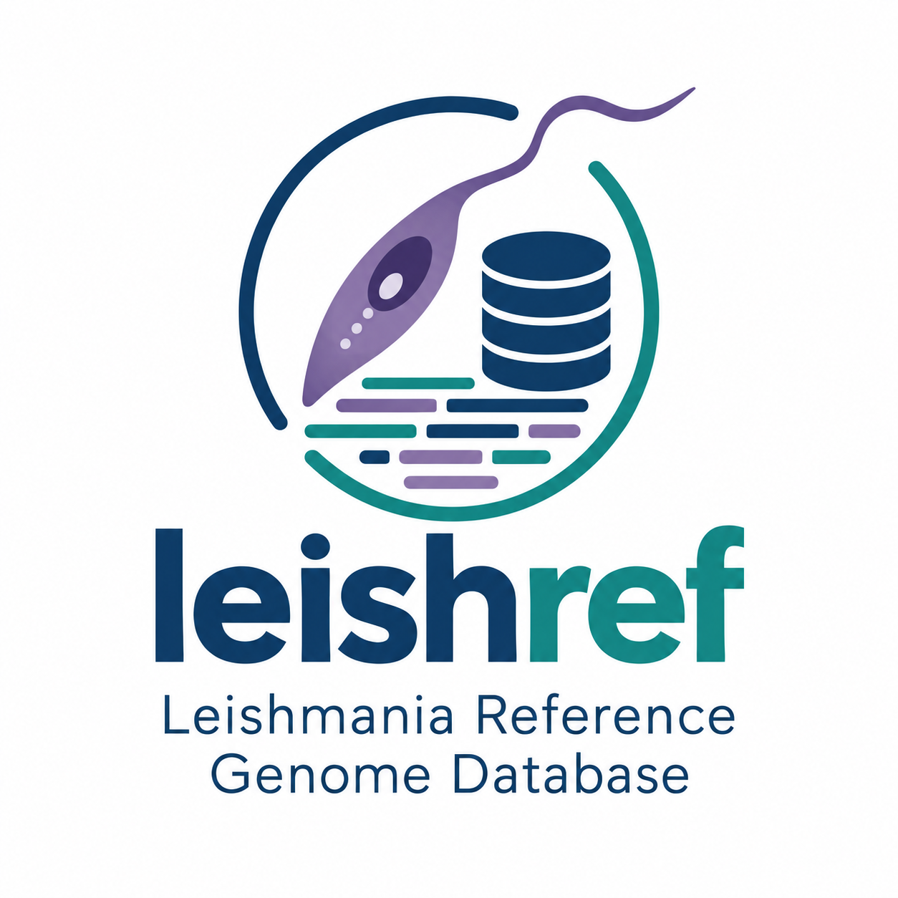

# Leishmania Reference Genome Database (leishref)



A curated catalog of Leishmania genomes that ships inside the package, so
`pip install leishref` is the only entry point you need: no hunting across NCBI,
TriTrypDB and Zenodo to find out what exists or where it lives.

**Key features:**
- One directory per genome, each with a `metadata.yaml` carrying source, accession,
  checksums, statistics and provenance
- `leishref search donovani` over the whole catalog; `download --alias` installs and checks the md5
- Alias-named symlinks so you can type `Ltrop.L590.fna` instead of
  `GCA_000410715.1_Leishmania_tropica_L590-2.0.2_genomic.fna`
- Layouts recorded as derivations (parent assembly plus an AGP) rather than as separate genomes
- Ragtag scaffolding with AGP-based cleaning that preserves chromosome-anchored
  sequence and the kinetoplast
- Per-genome Zenodo publishing for citable DOIs

---

## Installation

```bash
pip install leishref        # or: poetry install, for development
leishref info               # the catalog is already there
```

Optional, for the maintainer commands: the NCBI `datasets` CLI (`damona activate
sequana_tools`) and `ragtag.py`.

---

## Two halves

Using the database and maintaining it are different jobs, so the commands are split:

```console
$ leishref --help
  download   Install a catalog genome into the local database under ALIAS
  info       List the catalog and the local database
  search     Find catalog genomes matching every term
  verify     Check the local database against recorded checksums
  link       Refresh the alias-named symlinks
  dev        Commands for maintaining the shipped catalog

$ leishref dev --help
  fetch        Add an NCBI genome to the catalog
  add          Add a local assembly to the catalog
  scaffold     Scaffold an assembly against a reference with ragtag
  publish      Deposit an installed genome on Zenodo
  derive-agp   Derive an AGP showing how one assembly was laid out from another
```

Everything under `dev` writes to `leishref/data/`, the catalog that ships with the
package. Those changes are meant to travel as a pull request.

---

## The catalog

Each genome is a directory holding a single `metadata.yaml`:

```
leishref/data/
  GCA_000410715.1/metadata.yaml
  GCA_003719575.1/metadata.yaml
  GCF_000002875.2/metadata.yaml
  Ltropica.Ld1S.scaffold.flye/metadata.yaml    # no accession: named by the maintainer
```

```yaml
identifier: GCA_000227135.2
source: NCBI
accession: GCA_000227135.2
taxon_id: 5661
species: Leishmania donovani
strain: BPK282A1
assembly_name: ASM22713v2
assembly_level: Chromosome
release_date: '2011-12-13'
files:
  fasta: GCA_003719575.1_ASM371957v1_genomic.fna
  gff: GCA_003719575.1_ASM371957v1_genomic.gff
checksums:
  fasta: 89dbdf0dd945c963164f92fcfbe16ac7
  gff: ec6b6d0505165183095938e031ca28b8
stats:
  num_bases: 32444968
  num_ungapped: 31252241
  num_scaffolds: 36
  num_contigs: 2152
  gc_percent: 59.5
  scaffold_n50: 1024085
  scaffold_l50: 11
  contig_n50: 45436
  contig_l50: 197
  num_ambiguous: 1192833
  num_gaps: 2116
provenance:
  bioproject: PRJEA61817
  biosample: SAMEA2271930
date_added: '2026-09-11'
```

The directory is named by accession where there is one. There is no separate index to
keep in sync: the directory tree *is* the catalog.

`provenance` is free-form. NCBI supplies bioproject, biosample and sequencing technology
where it has them; `dev add` takes `--technology` and `--assembler`, and anything else
useful can simply be added to the file.

### How the statistics are defined

| field | definition |
|---|---|
| `num_bases` | total length of all sequences, ambiguous bases included |
| `num_ungapped` | `num_bases` less the bases inside gaps |
| `num_scaffolds` | number of records in the FASTA |
| `num_contigs` | number of gapless blocks, counted across all scaffolds |
| `gc_percent` | `(G + C) / (A + C + G + T)` — **N excluded from the denominator** |
| `scaffold_n50` / `contig_n50` | length at which the cumulative sorted length passes half the assembly |
| `scaffold_l50` / `contig_l50` | how many sequences that took |
| `num_ambiguous` | total count of N bases |
| `num_gaps` | number of *runs* of N at least 10 long |

These reproduce NCBI's own `assembly_stats` exactly, field for field, which is how the
gap rule below was settled.

**Scaffolds are not contigs.** A FASTA record is a scaffold; the gapless blocks inside it
are contigs. Counting records and calling the result contigs understates a gapped
assembly badly — `GCA_000227135.2` has 36 records but 2152 contigs, and its scaffold N50
of 1.02 Mb drops to 45 kb at contig level. Both numbers are true; they answer different
questions.

**A gap is a run of at least 10 N.** Shorter runs are ambiguous bases inside a contig:
they count towards `num_ambiguous` but do not split a contig or reduce `num_ungapped`.
This is NCBI's rule. In `GCA_000227135.2` there are 25 runs shorter than 10, totalling
106 bases, and that 106 is exactly the difference between NCBI's `total_ungapped_length`
and the plain non-N base count. `min_gap` is adjustable if you need a different
convention.

**`gc_percent` excludes ambiguous bases.** This is the usual definition, but it is worth
stating because the alternative — dividing by every base, N included — is easy to
implement by accident and silently reports something else. What it reports is not GC
content but GC content multiplied by the fraction of the assembly that was resolved, so
the figure falls as an assembly gets gappier even when its actual base composition is
unchanged.

The effect is not subtle. Every entry in this catalog is a *Leishmania* genome, and the
genus sits near 59–60% GC. Counting N in the denominator gave:

| genome | gaps | GC counting N | GC excluding N |
|---|---:|---:|---:|
| `GCA_003719575.1` | 0 | 59.75% | 59.75% |
| `GCA_000410715.1` | 1840 | 56.88% | 59.90% |
| `GCA_001989975.1` | 2346 | 52.68% | 59.44% |

NCBI's published `gc_percent` is rounded to the nearest 0.5, so it will not match to two
decimals; computing from its own `gc_count` and `atgc_count` gives the same figures
leishref reports.

Gap-free assemblies are unaffected, so the error hides until you compare across
assemblies of differing quality — at which point it looks like a biological difference
between strains. It is not: it is a 2346-gap assembly. Excluding N puts the whole catalog
between 59.4 and 60.2%.

If you compare these numbers against another tool and they disagree in the second digit,
check which denominator that tool uses.

**`num_gaps` counts runs, not bases.** A single 100-N join and a single 10,000-N unknown
stretch each count as one gap, so the figure answers "how many joins or unresolved
regions are in here" rather than "how much is missing" — that is `num_ambiguous`. A run
spanning several wrapped lines still counts once, and a run at the end of one contig is
not merged with one at the start of the next.

**N50 and L50** separate a chromosome-level assembly from a heap of contigs better than a
record count does. `search` shows the scaffold figures; both levels are in the record.

`source` says where `download` fetches a genome from, not who assembled it:

| source | meaning |
|---|---|
| `NCBI` | fetched by accession through the `datasets` CLI |
| `Zenodo` | published to Zenodo; retrieved by DOI, no token needed |
| `TriTrypDB` | downloaded by hand, because their downloads require a login |
| `Local` | added from disk and not published anywhere yet |
| `Scaffold` | produced by `dev scaffold` and not published yet |

`dev publish` moves a genome to `Zenodo` when it records the DOI, which is the point at
which it becomes retrievable by anyone else.

---

## Using the database

### Install a genome

`--alias` is required. It is the name the genome takes on your machine: the directory
under `data/`, and the symlink you will actually type.

`--alias` is required, but leishref proposes one rather than leaving you to invent it:

```console
$ leishref download GCA_000410715.1
--alias is required: it names this genome in your local database,
becoming the directory under data/ and the symlink you will type.

  leishref download GCA_000410715.1 --alias Ltrop.ncbi.L590
```

The suggestion is `<Lspec>.<source>.<discriminator>`, where the discriminator is the
strain when one is known -- including strains NCBI hides in `assembly_name` because it
left the strain field empty -- and the accession otherwise. `leishref info <name>` shows
it too. Take it or pick your own.

```console
$ leishref download GCA_000410715.1 --alias Ltrop.L590
GCA_000410715.1 -> GCA_000410715.1 (NCBI)
Installed into data/Ltrop.L590
  md5 OK: GCA_000410715.1_Leishmania_tropica_L590-2.0.2_genomic.fna
  Ltrop.L590.fna -> data/Ltrop.L590/GCA_000410715.1_..._genomic.fna
  Ltrop.L590.gff -> data/Ltrop.L590/GCA_000410715.1_..._genomic.gff
```

leishref prefers a Zenodo DOI where the catalog records one and falls back to the NCBI
accession, then checks what arrived against the recorded checksum. Zenodo downloads need
no token. TriTrypDB genomes have neither identifier, because their downloads now require
a login; fetch those by hand and register them with `leishref dev add`.

The result:

```
data/Ltrop.L590/
  metadata.yaml         # copied from the catalog, identifier rewritten to your alias
  GCA_000410715.1_Leishmania_tropica_L590-2.0.2_genomic.fna
  GCA_000410715.1_Leishmania_tropica_L590-2.0.2_genomic.gff
Ltrop.L590.fna -> data/Ltrop.L590/...     # relative symlink
Ltrop.L590.gff -> data/Ltrop.L590/...
```

The extension is preserved so file-type sniffing works, and links are relative so the
tree can be moved or shared. `leishref link` refreshes them; `--no-link` opts out. An
existing symlink is repointed, but a regular file of the same name is never overwritten.

### Look around

```bash
leishref info                    # catalog and local database
leishref info GCA_000410715.1    # one genome, in full
leishref info Ltrop.L590         # local genomes resolve by alias
```

### Search

Terms are matched against the whole record -- species, strain, accession, taxon id,
assembly name, filenames, provenance -- so you can look a genome up by whatever you
happen to know about it. Several terms narrow the result rather than widening it.

```console
$ leishref search donovani
5 matches for 'donovani'

  GCA_000227135.2      Leishmania donovani       NCBI    32.4 Mb   36 seqs
  GCA_001989975.1      Leishmania donovani       NCBI    32.2 Mb   36 seqs
  ...

$ leishref search tropica
8 matches for 'tropica'

  GCA_000410715.1              Leishmania tropica L590  NCBI    33.0 Mb    448 seqs  N50 303 kb
  GCA_048773145.2              Leishmania tropica       NCBI    35.8 Mb  26199 seqs   N50 4 kb
  Ltropica.Ld1S.scaffold.flye  Leishmania tropica CDC   Zenodo  33.6 Mb     76 seqs  N50 1.2 Mb
  ...
```

```bash
leishref search 5661            # by taxon id
leishref search PRJNA450813     # by bioproject
leishref search tropica --installed   # only what you already have
leishref search L590 --long     # full records rather than one line each
```

Genomes already in your local database are flagged `[installed as <alias>]`.

### Check integrity

```bash
leishref verify           # re-hash every installed file
leishref verify --quick   # presence only
```

Exits non-zero on a missing file or a checksum mismatch, so it can gate CI or run from cron.

---

## Maintaining the catalog

```bash
# Add an NCBI genome. --alias also keeps the files locally rather than discarding them.
leishref dev fetch GCA_000410715.1 --alias Ltrop.L590

# Register your own assembly
leishref dev add assembly.fa --alias Ltrop.flye --species "Leishmania tropica" \
  --technology "PacBio RS II" --assembler Flye

# Scaffold against an installed reference
leishref dev scaffold --query flye.fa --reference Ltrop.L590 --alias Ltrop.flye --clean

# Publish and record the DOI
export ZENODO_TOKEN=...            # fish: set -x ZENODO_TOKEN ...
leishref dev publish Ltrop.flye --confirm --version v1.0
```

Use `ZENODO_SANDBOX_TOKEN` with `--sandbox` to rehearse. A sandbox DOI is deliberately
not recorded, since it would block the real publish later.

**Contributing a genome:** run `leishref dev fetch` or `dev add`, check the new
`leishref/data/<id>/metadata.yaml`, and open a pull request. Only metadata is committed;
sequence data never enters the repository.

---

## Derivation model

Contig counts differ wildly between sources for the same organism. For *L. tropica* L590:

| source | sequences |
|---|---|
| NCBI `GCA_000410715.1` | 448 (182 scaffolds + 266 WGS contigs) |
| TriTrypDB-68 | 160 (36 chromosomes + 124 supercontigs) |
| ragtag on Ld1S | 140 |

These are **not three genomes**. They are one sequence with three chromosome
assignments. Measured on the NCBI/TriTrypDB pair: non-N content differs by 324 bases
in 31.3 Mb (0.001%), and every large NCBI scaffold appears inside the TriTrypDB
assembly — about half of them reverse-complemented, joined with 100-N padding.

So leishref records a layout as a **derivation**, not as a new genome:

- `derived_from` — the parent assembly supplying the sequence
- `agp_filename` — an AGP giving order, orientation and gaps relative to that parent

Two consequences:

1. **Choosing what to use** becomes an explicit choice of layout over one lineage,
   not a guess about which FASTA is "better".
2. **Third-party sequence never needs redistributing.** An AGP is coordinates —
   a few hundred KB of facts. `leishref derive-agp` produces one; `apply_agp()`
   regenerates the child FASTA from parent + AGP. Zenodo depositions therefore
   only ever carry your own assemblies, your AGPs, and the manifest.

```bash
leishref derive-agp \
  NCBI/GCA_000410715.1_Leishmania_tropica_L590-2.0.2_genomic.fna \
  TriTryDB68/TriTrypDB-68_LtropicaL590_Genome.fasta \
  --record

#   parent sequences:  448 (441 placed)
#   child sequences:   160 (158 used)
#   blocks placed:     1894/1938
#   orientation:       969 forward, 925 reverse
#   coverage:          97.556% of non-N parent bases
#   Same sequence, different layout: child is a re-scaffolding of parent.
```

Coverage below ~95% means the two really are different assemblies, not a re-layout.

The residual on this pair (2.4% N from unplaced blocks, 0.026% true mismatch on
round-trip) is TriTrypDB's own sequence editing — visible precisely *because* the
layout is now explicit.

### TriTrypDB access

TriTrypDB downloads now require a login, so `leishref fetch-tritrypdb` cannot fetch
unattended. Download the release by hand, then register each genome as a derivation
of its NCBI parent with `derive-agp --record`. Their GFF is in chromosome
coordinates and NCBI's is in scaffold coordinates; the same AGP is what relates them.

---

## Development

```bash
poetry install
poetry run pytest
poetry run pytest --cov=leishref --cov-report=term-missing
```

`pytest-asyncio` in the ambient conda env is incompatible with this pytest and breaks
collection, so `addopts = "-p no:asyncio"` in `pyproject.toml` disables it.

```bash
black --line-length=120 leishref/ tests/
isort --profile=black leishref/ tests/
flake8 leishref/ tests/
```

**Layout**

```
leishref/
  cli.py        user commands, plus the dev group
  metadata.py   Genome records, catalog and local database
  links.py      alias-named symlinks
  checksums.py  md5, length, contig count, GC
  ncbi.py       datasets CLI wrapper
  tritrypdb.py  TriTrypDB download (needs a login; see above)
  scaffold.py   ragtag wrapper and AGP-based cleaning
  agp.py        AGP derivation and reconstruction
  zenodo.py     deposition and record download
  data/         THE CATALOG, one directory per genome
```

---

## Troubleshooting

**ragtag.py not found** — install it into the active environment, or keep it on `PATH`.

**datasets CLI not available** — `damona activate sequana_tools`.

**Zenodo auth fails** — check `ZENODO_TOKEN` (or `ZENODO_SANDBOX_TOKEN` for `--sandbox`).
In fish, `set -x` is needed to export.

**A genome will not download** — TriTrypDB entries have no DOI or accession by design.
Download by hand and use `leishref dev add`.

---

## Citation

Cite the original NCBI or TriTrypDB source, and the Zenodo DOI recorded in the genome's
`metadata.yaml` where there is one.
